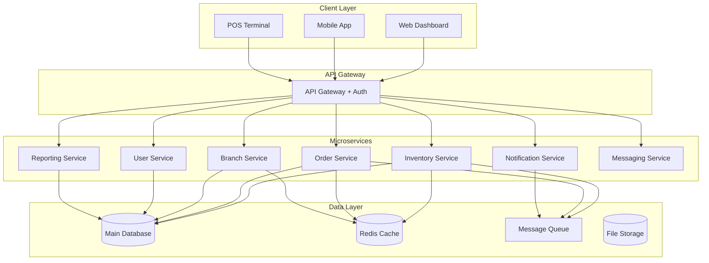

# Design Document - ระบบจัดการสต๊อคสินค้าแบบครบวงจร

## Overview

ระบบจัดการสต๊อคสินค้าแบบครบวงจรที่ออกแบบมาเพื่อรองรับธุรกิจที่มีการจัดจำหน่ายผ่านสาขามากกว่า 100 สาขา โดยใช้สถาปัตยกรรมแบบ Microservices และ Event-driven เพื่อให้สามารถขยายตัวได้และมีประสิทธิภาพในการซิงค์ข้อมูลแบบเรียลไทม์

### Key Design Principles
- **Scalability**: รองรับการขยายตัวของธุรกิจ
- **Real-time Data Sync**: ข้อมูลอัพเดทแบบเรียลไทม์ทุกสาขา
- **Multi-unit Support**: รองรับหน่วยการวัดที่หลากหลาย
- **Role-based Access**: การเข้าถึงข้อมูลตามบทบาทและสาขา
- **Audit Trail**: ติดตามการเปลี่ยนแปลงข้อมูลทั้งหมด

## Architecture

### High-Level Architecture



### Technology Stack

**Backend:**
- **Framework**: Node.js with Express.js / Python with FastAPI
- **Database**: PostgreSQL (primary), Redis (caching)
- **Message Queue**: RabbitMQ / Apache Kafka
- **Authentication**: JWT with Role-Based Access Control
- **API Documentation**: OpenAPI/Swagger

**Frontend:**
- **Web Dashboard**: React.js with TypeScript
- **Mobile App**: React Native / Flutter
- **State Management**: Redux Toolkit / Zustand
- **UI Framework**: Material-UI / Ant Design

**Infrastructure:**
- **Containerization**: Docker + Kubernetes
- **Monitoring**: Prometheus + Grafana
- **Logging**: ELK Stack (Elasticsearch, Logstash, Kibana)
- **File Storage**: AWS S3 / MinIO

## Components and Interfaces

### 1. Inventory Service

**Responsibilities:**
- จัดการสต๊อคสินค้าในหน่วยต่างๆ
- การแปลงหน่วยและการแบ่งสินค้า
- การติดตามการเคลื่อนไหวของสต๊อค
- การจัดการ SKU ผสมและกระเช้าของขวัญ

**Key APIs:**
```typescript
interface InventoryService {
  // Product Management
  createProduct(product: ProductInput): Promise<Product>
  updateProduct(id: string, updates: ProductUpdate): Promise<Product>
  getProduct(id: string): Promise<Product>
  
  // Stock Management
  addStock(productId: string, quantity: number, unit: Unit, location: string): Promise<StockTransaction>
  removeStock(productId: string, quantity: number, unit: Unit, location: string): Promise<StockTransaction>
  transferStock(from: string, to: string, items: StockItem[]): Promise<StockTransfer>
  
  // Unit Conversion
  convertUnit(quantity: number, fromUnit: Unit, toUnit: Unit, productId: string): Promise<number>
  
  // Stock Inquiry
  getStockLevel(productId: string, location: string): Promise<StockLevel>
  getLowStockAlerts(location?: string): Promise<LowStockAlert[]>
}
```

### 2. Order Service

**Responsibilities:**
- จัดการออเดอร์จัดส่งไปยังสาขา
- ติดตามสถานะการจัดส่ง
- การยืนยันการรับสินค้า
- การจัดการออเดอร์ลูกค้าตรง

**Key APIs:**
```typescript
interface OrderService {
  // Delivery Orders
  createDeliveryOrder(order: DeliveryOrderInput): Promise<DeliveryOrder>
  updateOrderStatus(orderId: string, status: OrderStatus): Promise<DeliveryOrder>
  confirmDelivery(orderId: string, confirmation: DeliveryConfirmation): Promise<void>
  
  // Customer Orders
  createCustomerOrder(order: CustomerOrderInput): Promise<CustomerOrder>
  getOrderHistory(customerId: string): Promise<CustomerOrder[]>
  
  // Driver Interface
  getDriverOrders(driverId: string): Promise<DeliveryOrder[]>
  updateDeliveryStatus(orderId: string, status: DeliveryStatus, location?: GeoLocation): Promise<void>
}
```

### 3. Branch Service

**Responsibilities:**
- จัดการข้อมูลสาขา
- การบันทึกการขาย
- การจัดการสินค้าชิม
- การเปรียบเทียบข้อมูลกับห้าง

**Key APIs:**
```typescript
interface BranchService {
  // Branch Management
  createBranch(branch: BranchInput): Promise<Branch>
  updateBranch(id: string, updates: BranchUpdate): Promise<Branch>
  getBranch(id: string): Promise<Branch>
  
  // Sales Recording
  recordSale(branchId: string, sale: SaleInput): Promise<Sale>
  getSalesReport(branchId: string, period: DateRange): Promise<SalesReport>
  
  // Sampling Management
  recordSampling(branchId: string, sampling: SamplingInput): Promise<Sampling>
  getSamplingReport(branchId: string, period: DateRange): Promise<SamplingReport>
  
  // Mall Integration
  uploadMallReport(branchId: string, report: MallReportInput): Promise<void>
  compareSalesData(branchId: string, period: DateRange): Promise<SalesComparison>
}
```

### 4. User Service

**Responsibilities:**
- จัดการผู้ใช้และการยืนยันตัวตน
- การจัดการบทบาทและสิทธิ์
- การจัดการพนักงานและการมอบหมายสาขา
- ระบบลาและการโอนย้าย

**Key APIs:**
```typescript
interface UserService {
  // Authentication
  login(credentials: LoginInput): Promise<AuthResult>
  refreshToken(token: string): Promise<AuthResult>
  logout(userId: string): Promise<void>
  
  // User Management
  createUser(user: UserInput): Promise<User>
  updateUser(id: string, updates: UserUpdate): Promise<User>
  assignUserToBranch(userId: string, branchId: string): Promise<void>
  
  // Leave Management
  submitLeaveRequest(request: LeaveRequestInput): Promise<LeaveRequest>
  approveLeaveRequest(requestId: string, approval: LeaveApproval): Promise<void>
}
```

### 5. Reporting Service

**Responsibilities:**
- สร้างรายงานและแดชบอร์ด
- การวิเคราะห์ข้อมูลการขาย
- การติดตามประสิทธิภาพสาขา
- การส่งออกข้อมูล

**Key APIs:**
```typescript
interface ReportingService {
  // Dashboard Data
  getDashboardData(userId: string): Promise<DashboardData>
  getBranchPerformance(branchId?: string, period?: DateRange): Promise<BranchPerformance[]>
  
  // Sales Analytics
  getSalesAnalytics(filters: AnalyticsFilters): Promise<SalesAnalytics>
  getProductPerformance(productId?: string, branchId?: string): Promise<ProductPerformance[]>
  
  // Inventory Reports
  getInventoryReport(location?: string): Promise<InventoryReport>
  getStockMovementReport(period: DateRange, location?: string): Promise<StockMovementReport>
  
  // Export Functions
  exportReport(reportType: ReportType, filters: ReportFilters): Promise<ExportResult>
}
```

### 6. Notification Service

**Responsibilities:**
- การแจ้งเตือนสต๊อคใกล้หมด
- การแจ้งเตือนการจัดส่ง
- การแจ้งเตือนระบบทั่วไป

**Key APIs:**
```typescript
interface NotificationService {
  // Alert Management
  createAlert(alert: AlertInput): Promise<Alert>
  getAlerts(userId: string, filters?: AlertFilters): Promise<Alert[]>
  markAlertAsRead(alertId: string): Promise<void>
  
  // Notification Delivery
  sendNotification(notification: NotificationInput): Promise<void>
  sendBulkNotification(notifications: NotificationInput[]): Promise<void>
  
  // Subscription Management
  subscribeToAlerts(userId: string, alertTypes: AlertType[]): Promise<void>
  unsubscribeFromAlerts(userId: string, alertTypes: AlertType[]): Promise<void>
}
```

### 7. Messaging Service

**Responsibilities:**
- ระบบสื่อสารภายในองค์กร
- การส่งข้อความแบบเรียลไทม์
- การจัดการกลุ่มและช่องทางการสื่อสار

**Key APIs:**
```typescript
interface MessagingService {
  // Message Management
  sendMessage(message: MessageInput): Promise<Message>
  getMessages(conversationId: string, pagination?: Pagination): Promise<Message[]>
  markMessageAsRead(messageId: string): Promise<void>
  
  // Conversation Management
  createConversation(participants: string[], type: ConversationType): Promise<Conversation>
  getConversations(userId: string): Promise<Conversation[]>
  
  // Real-time Features
  joinConversation(userId: string, conversationId: string): Promise<void>
  leaveConversation(userId: string, conversationId: string): Promise<void>
}
```

## Data Models

### Core Entities

```typescript
// Product and Inventory
interface Product {
  id: string
  name: string
  description?: string
  category: string
  barcode: string
  baseUnit: Unit
  unitConversions: UnitConversion[]
  isComposite: boolean
  components?: ProductComponent[]
  createdAt: Date
  updatedAt: Date
}

interface StockLevel {
  productId: string
  location: string
  quantity: number
  unit: Unit
  reservedQuantity: number
  availableQuantity: number
  reorderPoint: number
  maxStock: number
  lastUpdated: Date
}

interface StockTransaction {
  id: string
  productId: string
  location: string
  type: TransactionType // 'IN' | 'OUT' | 'TRANSFER' | 'ADJUSTMENT'
  quantity: number
  unit: Unit
  reference?: string
  userId: string
  timestamp: Date
  notes?: string
}

// Orders and Delivery
interface DeliveryOrder {
  id: string
  orderNumber: string
  fromLocation: string
  toLocation: string
  items: OrderItem[]
  status: OrderStatus
  driverId?: string
  scheduledDate: Date
  deliveredDate?: Date
  createdBy: string
  createdAt: Date
  updatedAt: Date
}

interface OrderItem {
  productId: string
  quantity: number
  unit: Unit
  confirmedQuantity?: number
  notes?: string
}

// Branch and Sales
interface Branch {
  id: string
  name: string
  code: string
  address: string
  type: BranchType // 'OWNED' | 'MALL' | 'FRANCHISE'
  managerId: string
  isActive: boolean
  settings: BranchSettings
  createdAt: Date
  updatedAt: Date
}

interface Sale {
  id: string
  branchId: string
  items: SaleItem[]
  totalAmount: number
  paymentMethod?: string
  customerId?: string
  userId: string
  timestamp: Date
  mallReportId?: string
}

interface SaleItem {
  productId: string
  quantity: number
  unit: Unit
  unitPrice: number
  totalPrice: number
}

// User Management
interface User {
  id: string
  username: string
  email: string
  firstName: string
  lastName: string
  role: UserRole
  assignedBranches: string[]
  isActive: boolean
  lastLogin?: Date
  createdAt: Date
  updatedAt: Date
}

// Units and Conversions
interface Unit {
  code: string
  name: string
  type: UnitType // 'WEIGHT' | 'VOLUME' | 'COUNT' | 'PACKAGE'
}

interface UnitConversion {
  fromUnit: string
  toUnit: string
  factor: number
  productId?: string
}
```

### Enums and Types

```typescript
enum TransactionType {
  IN = 'IN',
  OUT = 'OUT',
  TRANSFER = 'TRANSFER',
  ADJUSTMENT = 'ADJUSTMENT',
  SAMPLING = 'SAMPLING'
}

enum OrderStatus {
  PENDING = 'PENDING',
  CONFIRMED = 'CONFIRMED',
  IN_TRANSIT = 'IN_TRANSIT',
  DELIVERED = 'DELIVERED',
  CANCELLED = 'CANCELLED'
}

enum UserRole {
  ADMIN = 'ADMIN',
  MANAGER = 'MANAGER',
  WAREHOUSE_STAFF = 'WAREHOUSE_STAFF',
  BRANCH_MANAGER = 'BRANCH_MANAGER',
  BRANCH_STAFF = 'BRANCH_STAFF',
  DRIVER = 'DRIVER',
  CUSTOMER_SERVICE = 'CUSTOMER_SERVICE'
}

enum BranchType {
  OWNED = 'OWNED',
  MALL = 'MALL',
  FRANCHISE = 'FRANCHISE'
}

enum UnitType {
  WEIGHT = 'WEIGHT',
  VOLUME = 'VOLUME',
  COUNT = 'COUNT',
  PACKAGE = 'PACKAGE'
}
```

## Error Handling

### Error Response Format

```typescript
interface ErrorResponse {
  error: {
    code: string
    message: string
    details?: any
    timestamp: string
    requestId: string
  }
}
```

### Common Error Codes

- **INSUFFICIENT_STOCK**: สต๊อคไม่เพียงพอ
- **INVALID_UNIT_CONVERSION**: การแปลงหน่วยไม่ถูกต้อง
- **UNAUTHORIZED_ACCESS**: ไม่มีสิทธิ์เข้าถึง
- **BRANCH_NOT_FOUND**: ไม่พบสาขา
- **ORDER_NOT_FOUND**: ไม่พบออเดอร์
- **DUPLICATE_BARCODE**: บาร์โค้ดซ้ำ
- **INVALID_QUANTITY**: จำนวนไม่ถูกต้อง

### Error Handling Strategy

1. **Validation Errors**: ตรวจสอบข้อมูลก่อนประมวลผล
2. **Business Logic Errors**: จัดการข้อผิดพลาดทางธุรกิจ
3. **System Errors**: จัดการข้อผิดพลาดของระบบ
4. **Retry Mechanism**: ลองใหม่สำหรับการดำเนินการที่ล้มเหลว
5. **Circuit Breaker**: ป้องกันการเรียก service ที่มีปัญหา

## Testing Strategy

### Unit Testing
- **Coverage Target**: 80%+ code coverage
- **Framework**: Jest (Node.js) / pytest (Python)
- **Focus Areas**: Business logic, data validation, unit conversions

### Integration Testing
- **API Testing**: ทุก endpoint ต้องมี integration test
- **Database Testing**: ทดสอบการทำงานกับฐานข้อมูล
- **Message Queue Testing**: ทดสอบการส่งและรับ message

### End-to-End Testing
- **User Workflows**: ทดสอบ workflow ที่สำคัญ
- **Cross-service Communication**: ทดสอบการทำงานร่วมกันของ services
- **Performance Testing**: ทดสอบประสิทธิภาพภายใต้ load

### Test Data Management
- **Test Database**: ใช้ฐานข้อมูลแยกสำหรับทดสอบ
- **Data Seeding**: สร้างข้อมูลทดสอบแบบอัตโนมัติ
- **Data Cleanup**: ล้างข้อมูลหลังการทดสอบ

## Security Considerations

### Authentication & Authorization
- **JWT Tokens**: ใช้ JWT สำหรับ authentication
- **Role-Based Access Control**: จำกัดการเข้าถึงตามบทบาท
- **Branch-Level Isolation**: แยกข้อมูลตามสาขา
- **Token Expiration**: กำหนดอายุ token

### Data Protection
- **Encryption at Rest**: เข้ารหัสข้อมูลในฐานข้อมูล
- **Encryption in Transit**: ใช้ HTTPS/TLS
- **Input Validation**: ตรวจสอบข้อมูลนำเข้าทั้งหมด
- **SQL Injection Prevention**: ใช้ parameterized queries

### Audit Trail
- **Activity Logging**: บันทึกการกระทำทั้งหมด
- **Change Tracking**: ติดตามการเปลี่ยนแปลงข้อมูล
- **User Session Tracking**: ติดตาม session ของผู้ใช้

## Performance Optimization

### Database Optimization
- **Indexing Strategy**: สร้าง index ที่เหมาะสม
- **Query Optimization**: ปรับปรุง query ให้มีประสิทธิภาพ
- **Connection Pooling**: ใช้ connection pool
- **Read Replicas**: ใช้ read replica สำหรับ reporting

### Caching Strategy
- **Redis Caching**: cache ข้อมูลที่เข้าถึงบ่อย
- **Application-Level Caching**: cache ในระดับ application
- **CDN**: ใช้ CDN สำหรับ static assets

### Real-time Performance
- **WebSocket Connections**: สำหรับ real-time updates
- **Message Queue Optimization**: ปรับแต่ง message queue
- **Event Sourcing**: ใช้ event sourcing สำหรับ audit trail

## Deployment Architecture

### Environment Strategy
- **Development**: สำหรับการพัฒนา
- **Staging**: สำหรับการทดสอบ
- **Production**: สำหรับการใช้งานจริง

### Container Strategy
- **Docker Images**: แต่ละ service เป็น container แยกกัน
- **Kubernetes Orchestration**: ใช้ K8s สำหรับ orchestration
- **Health Checks**: ตรวจสอบสุขภาพของ services
- **Auto Scaling**: ขยายตัวอัตโนมัติตาม load

### Monitoring & Observability
- **Application Metrics**: ติดตาม metrics ของ application
- **Infrastructure Metrics**: ติดตาม metrics ของ infrastructure
- **Distributed Tracing**: ติดตาม request ข้าม services
- **Log Aggregation**: รวบรวม logs จากทุก services