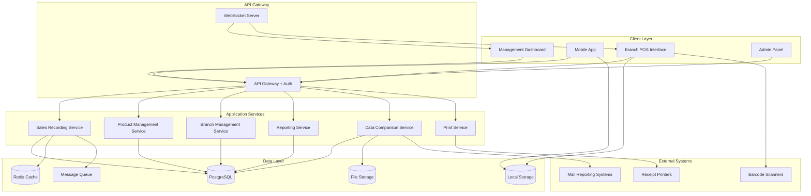

# Design Document - ระบบบันทึกการขายและจัดการสต๊อค

## Overview

ระบบบันทึกการขายและจัดการสต๊อคสำหรับสาขาผลไม้อบแห้งที่ตั้งอยู่ในห้างสรรพสินค้า ออกแบบให้เป็นระบบที่เน้นการใช้งานจริงที่จำเป็น ได้แก่ การบันทึกการขาย การจัดการสต๊อค การสั่งและรับสินค้า การแจ้งเตือน และการรายงานผล

### Key Design Principles
- **Practical Focus**: เน้นฟีเจอร์ที่ใช้งานจริงเท่านั้น
- **Multi-Branch Support**: รองรับหลายสาขาแต่ละสาขาจัดการสต๊อคแยกกัน
- **Real-time Inventory**: สต๊อคอัพเดทแบบเรียลไทม์เมื่อมีการขาย
- **Smart Alerts**: แจ้งเตือนสินค้าใกล้หมดอัตโนมัติ
- **Easy Ordering**: สั่งและรับสินค้าได้ง่าย
- **Sales Analytics**: วิเคราะห์ช่วงเวลาขายดีได้

## Architecture

### High-Level Architecture



### Technology Stack

**Frontend:**
- **Web Interface**: React.js with TypeScript
- **Mobile Support**: Progressive Web App (PWA)
- **State Management**: Zustand for lightweight state management
- **UI Framework**: Tailwind CSS with custom components
- **Real-time**: Socket.io client for WebSocket connections
- **Offline Storage**: IndexedDB for offline data storage

**Backend:**
- **Runtime**: Node.js with Express.js
- **Language**: TypeScript
- **Database**: PostgreSQL for main data, Redis for caching
- **Real-time**: Socket.io for WebSocket connections
- **Message Queue**: Redis Pub/Sub for real-time updates
- **File Processing**: Multer for file uploads, ExcelJS for Excel processing
- **Authentication**: JWT with role-based access control

**Infrastructure:**
- **Containerization**: Docker for development and deployment
- **Reverse Proxy**: Nginx for load balancing and static file serving
- **Monitoring**: Basic logging and health checks
- **Backup**: Automated database backups

## Components and Interfaces

### 1. Sales Recording Service

**Responsibilities:**
- บันทึกการขายจากสาขาต่างๆ
- การคำนวณราคาและยอดรวม
- การจัดการรายการขายแบบเรียลไทม์
- การซิงค์ข้อมูลระหว่างออฟไลน์และออนไลน์

**Key APIs:**
```typescript
interface SalesRecordingService {
  // Sales Transaction Management
  createSaleRecord(record: SaleRecordInput): Promise<SaleRecord>
  getSaleRecord(id: string): Promise<SaleRecord>
  getSaleRecords(filters: SaleRecordFilters): Promise<SaleRecord[]>
  
  // Real-time Sales Feed
  getLatestSales(limit: number): Promise<SaleRecord[]>
  subscribeSalesUpdates(callback: (sale: SaleRecord) => void): void
  
  // Offline Sync
  syncOfflineRecords(records: OfflineSaleRecord[]): Promise<SyncResult>
  getPendingSyncCount(): Promise<number>
  
  // Receipt Generation
  generateReceipt(saleId: string): Promise<ReceiptData>
  printReceipt(saleId: string, printerId?: string): Promise<PrintResult>
}
```

### 2. Product Management Service

**Responsibilities:**
- จัดการข้อมูลสินค้าและราคา
- การสร้างและจัดการบาร์โค้ด
- การค้นหาสินค้า
- การจัดการหน่วยการขาย (กรัม/ชิ้น)

**Key APIs:**
```typescript
interface ProductManagementService {
  // Product CRUD
  createProduct(product: ProductInput): Promise<Product>
  updateProduct(id: string, updates: ProductUpdate): Promise<Product>
  getProduct(id: string): Promise<Product>
  searchProducts(query: string): Promise<Product[]>
  
  // Barcode Management
  generateBarcode(productId: string): Promise<string>
  getProductByBarcode(barcode: string): Promise<Product>
  validateBarcode(barcode: string): Promise<boolean>
  
  // Price Calculation
  calculatePrice(productId: string, quantity: number, unit: SaleUnit): Promise<number>
  getPriceHistory(productId: string): Promise<PriceHistory[]>
}
```

### 3. Inventory Management Service

**Responsibilities:**
- จัดการสต๊อคสินค้าในแต่ละสาขา
- การหักสต๊อคเมื่อมีการขาย
- การแจ้งเตือนสินค้าใกล้หมด
- การสั่งและรับสินค้าจากคลัง

**Key APIs:**
```typescript
interface InventoryManagementService {
  // Stock Management
  getStockLevel(productId: string, branchId: string): Promise<StockLevel>
  updateStock(productId: string, branchId: string, quantity: number, type: StockMovementType): Promise<StockMovement>
  getStockLevels(branchId: string): Promise<StockLevel[]>
  
  // Low Stock Alerts
  getLowStockAlerts(branchId: string): Promise<LowStockAlert[]>
  setStockThreshold(productId: string, branchId: string, threshold: number): Promise<void>
  
  // Purchase Orders
  createPurchaseOrder(order: PurchaseOrderInput): Promise<PurchaseOrder>
  getPurchaseOrders(branchId: string, status?: OrderStatus): Promise<PurchaseOrder[]>
  updateOrderStatus(orderId: string, status: OrderStatus): Promise<PurchaseOrder>
  
  // Receiving
  receiveProducts(orderId: string, receivedItems: ReceivedItem[]): Promise<ReceiveResult>
  confirmReceiving(orderId: string): Promise<void>
}
```

### 4. Branch Management Service

**Responsibilities:**
- จัดการข้อมูลสาขาและพนักงาน
- การกำหนดสิทธิ์การเข้าถึงข้อมูล
- การจัดการการเข้าสู่ระบบ
- การติดตามการทำงานของพนักงาน

**Key APIs:**
```typescript
interface BranchManagementService {
  // Branch Management
  createBranch(branch: BranchInput): Promise<Branch>
  updateBranch(id: string, updates: BranchUpdate): Promise<Branch>
  getBranch(id: string): Promise<Branch>
  getAllBranches(): Promise<Branch[]>
  
  // Staff Management
  createStaff(staff: StaffInput): Promise<Staff>
  updateStaff(id: string, updates: StaffUpdate): Promise<Staff>
  getStaff(id: string): Promise<Staff>
  getStaffByBranch(branchId: string): Promise<Staff[]>
  
  // Authentication
  authenticateUser(credentials: LoginCredentials): Promise<AuthResult>
  refreshToken(token: string): Promise<AuthResult>
  logout(userId: string): Promise<void>
}
```

### 4. Data Comparison Service

**Responsibilities:**
- การอัพโหลดและประมวลผลรายงานจากห้าง
- การเปรียบเทียบข้อมูลการขาย
- การสร้างรายงานความแตกต่าง
- การ export ข้อมูลเปรียบเทียบ

**Key APIs:**
```typescript
interface DataComparisonService {
  // Mall Report Processing
  uploadMallReport(file: File, branchId: string, period: DateRange): Promise<MallReport>
  processMallReport(reportId: string): Promise<ProcessingResult>
  getMallReports(branchId: string): Promise<MallReport[]>
  
  // Data Comparison
  compareData(branchId: string, period: DateRange): Promise<ComparisonResult>
  getDiscrepancies(comparisonId: string): Promise<Discrepancy[]>
  
  // Export Functions
  exportComparison(comparisonId: string, format: ExportFormat): Promise<ExportResult>
  generateReconciliationReport(comparisonId: string): Promise<ReconciliationReport>
}
```

### 5. Reporting Service

**Responsibilities:**
- การสร้างรายงานการขาย
- การวิเคราะห์ข้อมูลและแนวโน้ม
- การสร้าง dashboard สำหรับผู้บริหาร
- การ export รายงานในรูปแบบต่างๆ

**Key APIs:**
```typescript
interface ReportingService {
  // Sales Reports
  getSalesReport(filters: SalesReportFilters): Promise<SalesReport>
  getDailySalesReport(date: Date, branchId?: string): Promise<DailySalesReport>
  getMonthlySalesReport(month: string, year: number): Promise<MonthlySalesReport>
  
  // Analytics
  getTopSellingProducts(period: DateRange, branchId?: string): Promise<ProductSales[]>
  getBranchPerformance(period: DateRange): Promise<BranchPerformance[]>
  getSalesTrends(period: DateRange, branchId?: string): Promise<SalesTrend[]>
  
  // Dashboard Data
  getDashboardData(userId: string): Promise<DashboardData>
  getRealTimeSalesFeed(): Promise<SaleRecord[]>
  
  // Export Functions
  exportReport(reportType: ReportType, filters: ReportFilters, format: ExportFormat): Promise<ExportResult>
}
```

## Data Models

### Core Entities

```typescript
// Sales Recording (Focus on Quantity, not Amount)
interface SaleRecord {
  id: string
  saleNumber: string
  branchId: string
  staffId: string
  items: SaleItem[]
  totalQuantity: number
  recordedAt: Date
  syncedAt?: Date
  notes?: string
  isOfflineRecord: boolean
}

interface SaleItem {
  id: string
  productId: string
  productName: string
  quantity: number
  unit: SaleUnit // 'GRAM' | 'PIECE'
  unitPrice: number
  totalPrice: number
  barcode?: string
}

// Product Management
interface Product {
  id: string
  name: string
  category: string
  description?: string
  barcode: string
  saleUnit: SaleUnit
  pricePerUnit: number
  isActive: boolean
  createdAt: Date
  updatedAt: Date
}

interface PriceHistory {
  id: string
  productId: string
  oldPrice: number
  newPrice: number
  changedBy: string
  changedAt: Date
  reason?: string
}

// Branch and Staff Management
interface Branch {
  id: string
  name: string
  code: string
  address: string
  mallName: string
  managerId?: string
  isActive: boolean
  settings: BranchSettings
  createdAt: Date
  updatedAt: Date
}

interface Staff {
  id: string
  username: string
  firstName: string
  lastName: string
  email?: string
  role: StaffRole
  branchId: string
  employeeId: string
  isActive: boolean
  lastLogin?: Date
  createdAt: Date
  updatedAt: Date
}

interface BranchSettings {
  timezone: string
  currency: string
  receiptTemplate: string
  printerSettings?: PrinterSettings
  offlineMode: boolean
}

// Inventory Management
interface StockLevel {
  id: string
  productId: string
  branchId: string
  quantity: number
  unit: SaleUnit
  threshold: number
  lastUpdated: Date
}

interface StockMovement {
  id: string
  productId: string
  branchId: string
  type: StockMovementType
  quantity: number
  previousQuantity: number
  newQuantity: number
  reference?: string
  staffId: string
  timestamp: Date
  notes?: string
}

interface LowStockAlert {
  id: string
  productId: string
  productName: string
  branchId: string
  branchName: string
  currentStock: number
  threshold: number
  severity: AlertSeverity
  createdAt: Date
  acknowledgedAt?: Date
}

// Purchase Orders
interface PurchaseOrder {
  id: string
  orderNumber: string
  branchId: string
  items: PurchaseOrderItem[]
  status: OrderStatus
  requestedBy: string
  requestedAt: Date
  approvedBy?: string
  approvedAt?: Date
  deliveredAt?: Date
  totalAmount: number
}

interface PurchaseOrderItem {
  productId: string
  productName: string
  requestedQuantity: number
  receivedQuantity?: number
  unitPrice: number
  totalPrice: number
}

interface ReceivedItem {
  productId: string
  receivedQuantity: number
  condition: string
  notes?: string
}

interface ReceiveResult {
  orderId: string
  receivedItems: ReceivedItem[]
  discrepancies: ItemDiscrepancy[]
  totalReceived: number
  receivedBy: string
  receivedAt: Date
}

// Sales Analytics
interface SalesTimePattern {
  hour: number
  dayOfWeek: number
  salesCount: number
  totalAmount: number
  averageAmount: number
}

interface HourlySalesData {
  date: Date
  branchId: string
  hourlyData: {
    hour: number
    salesCount: number
    totalAmount: number
  }[]
}

// Mall Integration
interface MallReport {
  id: string
  branchId: string
  fileName: string
  fileType: string
  uploadedBy: string
  uploadedAt: Date
  period: DateRange
  status: ProcessingStatus
  processedAt?: Date
  totalRecords: number
  errorCount: number
}

interface ComparisonResult {
  id: string
  branchId: string
  period: DateRange
  ourData: SalesData
  mallData: SalesData
  discrepancies: Discrepancy[]
  matchRate: number
  createdAt: Date
}

interface Discrepancy {
  productId: string
  productName: string
  ourQuantity: number
  mallQuantity: number
  difference: number
  ourAmount: number
  mallAmount: number
  amountDifference: number
  severity: DiscrepancySeverity
}

// Reporting
interface DashboardData {
  todaySales: SalesSummary
  recentSales: SaleRecord[]
  branchPerformance: BranchPerformance[]
  alerts: Alert[]
  syncStatus: SyncStatus
}

interface SalesSummary {
  totalAmount: number
  totalTransactions: number
  averageTransaction: number
  topProducts: ProductSales[]
}

interface BranchPerformance {
  branchId: string
  branchName: string
  salesAmount: number
  transactionCount: number
  averageTransaction: number
  growthRate: number
}

// Receipt and Printing
interface ReceiptData {
  saleId: string
  branchName: string
  staffName: string
  items: ReceiptItem[]
  totalAmount: number
  recordedAt: Date
  receiptNumber: string
  disclaimer: string
}

interface ReceiptItem {
  productName: string
  quantity: number
  unit: string
  unitPrice: number
  totalPrice: number
}
```

### Enums and Types

```typescript
enum SaleUnit {
  GRAM = 'GRAM',
  PIECE = 'PIECE'
}

enum StaffRole {
  ADMIN = 'ADMIN',
  MANAGER = 'MANAGER',
  BRANCH_MANAGER = 'BRANCH_MANAGER',
  STAFF = 'STAFF'
}

enum ProcessingStatus {
  PENDING = 'PENDING',
  PROCESSING = 'PROCESSING',
  COMPLETED = 'COMPLETED',
  FAILED = 'FAILED'
}

enum DiscrepancySeverity {
  LOW = 'LOW',
  MEDIUM = 'MEDIUM',
  HIGH = 'HIGH',
  CRITICAL = 'CRITICAL'
}

enum ExportFormat {
  EXCEL = 'EXCEL',
  PDF = 'PDF',
  CSV = 'CSV'
}

enum ReportType {
  DAILY_SALES = 'DAILY_SALES',
  MONTHLY_SALES = 'MONTHLY_SALES',
  PRODUCT_PERFORMANCE = 'PRODUCT_PERFORMANCE',
  BRANCH_COMPARISON = 'BRANCH_COMPARISON',
  DISCREPANCY_REPORT = 'DISCREPANCY_REPORT'
}

type DateRange = {
  startDate: Date
  endDate: Date
}

type SyncStatus = {
  isOnline: boolean
  pendingRecords: number
  lastSyncAt?: Date
  syncErrors: string[]
}
```

## Error Handling

### Error Response Format

```typescript
interface ErrorResponse {
  error: {
    code: string
    message: string
    details?: any
    timestamp: string
    requestId: string
  }
}
```

### Common Error Codes

- **PRODUCT_NOT_FOUND**: ไม่พบสินค้า
- **INVALID_QUANTITY**: จำนวนไม่ถูกต้อง
- **INVALID_BARCODE**: บาร์โค้ดไม่ถูกต้อง
- **BRANCH_ACCESS_DENIED**: ไม่มีสิทธิ์เข้าถึงสาขา
- **STAFF_NOT_FOUND**: ไม่พบพนักงาน
- **SYNC_FAILED**: การซิงค์ข้อมูลล้มเหลว
- **PRINT_FAILED**: การพิมพ์ล้มเหลว
- **FILE_PROCESSING_FAILED**: การประมวลผลไฟล์ล้มเหลว
- **COMPARISON_DATA_MISMATCH**: ข้อมูลเปรียบเทียบไม่ตรงกัน

### Error Handling Strategy

1. **Input Validation**: ตรวจสอบข้อมูลก่อนประมวลผล
2. **Graceful Degradation**: ระบบยังใช้งานได้แม้บางส่วนมีปัญหา
3. **Offline Fallback**: บันทึกข้อมูลไว้เมื่ออินเทอร์เน็ตขาด
4. **Retry Mechanism**: ลองใหม่สำหรับการดำเนินการที่ล้มเหลว
5. **User-Friendly Messages**: แสดงข้อความที่ผู้ใช้เข้าใจได้

## Testing Strategy

### Unit Testing
- **Coverage Target**: 85%+ code coverage
- **Framework**: Jest with TypeScript
- **Focus Areas**: Business logic, calculations, data validation

### Integration Testing
- **API Testing**: ทุก endpoint ต้องมี integration test
- **Database Testing**: ทดสอบการทำงานกับฐานข้อมูล
- **File Processing Testing**: ทดสอบการประมวลผลไฟล์ Excel/CSV

### End-to-End Testing
- **Sales Recording Flow**: ทดสอบการบันทึกการขายตั้งแต่เริ่มต้นจนจบ
- **Data Comparison Flow**: ทดสอบการเปรียบเทียบข้อมูลกับห้าง
- **Offline Sync Flow**: ทดสอบการทำงานแบบออฟไลน์และการซิงค์

### Mobile Testing
- **Responsive Design**: ทดสอบบนอุปกรณ์ต่างๆ
- **Touch Interface**: ทดสอบการใช้งานแบบสัมผัส
- **Offline Capability**: ทดสอบการทำงานแบบออฟไลน์

## Security Considerations

### Authentication & Authorization
- **JWT Tokens**: ใช้ JWT สำหรับ authentication
- **Role-Based Access**: จำกัดการเข้าถึงตามบทบาท
- **Branch-Level Security**: แยกข้อมูลตามสาขา
- **Session Management**: จัดการ session และ token expiration

### Data Protection
- **Input Validation**: ตรวจสอบข้อมูลนำเข้าทั้งหมด
- **SQL Injection Prevention**: ใช้ parameterized queries
- **File Upload Security**: ตรวจสอบไฟล์ที่อัพโหลด
- **Data Encryption**: เข้ารหัสข้อมูลสำคัญ

### Audit Trail
- **Activity Logging**: บันทึกการกระทำทั้งหมด
- **Change Tracking**: ติดตามการเปลี่ยนแปลงข้อมูล
- **Access Logging**: บันทึกการเข้าถึงระบบ

## Performance Optimization

### Database Optimization
- **Indexing**: สร้าง index สำหรับ query ที่ใช้บ่อย
- **Query Optimization**: ปรับปรุง query ให้มีประสิทธิภาพ
- **Connection Pooling**: ใช้ connection pool

### Caching Strategy
- **Redis Caching**: cache ข้อมูลสินค้าและราคา
- **Browser Caching**: cache static assets
- **API Response Caching**: cache response ที่ไม่เปลี่ยนแปลงบ่อย

### Real-time Performance
- **WebSocket Optimization**: ปรับแต่ง WebSocket connections
- **Message Queue**: ใช้ Redis Pub/Sub สำหรับ real-time updates
- **Debouncing**: จำกัดการส่งข้อมูลที่ไม่จำเป็น

### Mobile Optimization
- **Progressive Web App**: ใช้ PWA สำหรับประสิทธิภาพบน mobile
- **Offline Storage**: ใช้ IndexedDB สำหรับ offline data
- **Lazy Loading**: โหลดข้อมูลเมื่อจำเป็น
- **Image Optimization**: ปรับขนาดและคุณภาพรูปภาพ

## Deployment Architecture

### Environment Strategy
- **Development**: สำหรับการพัฒนา
- **Staging**: สำหรับการทดสอบ
- **Production**: สำหรับการใช้งานจริง

### Container Strategy
- **Docker Containers**: แต่ละ service เป็น container แยกกัน
- **Docker Compose**: สำหรับ development environment
- **Health Checks**: ตรวจสอบสุขภาพของ services

### Monitoring & Observability
- **Application Logs**: บันทึก logs ของ application
- **Error Tracking**: ติดตามข้อผิดพลาด
- **Performance Monitoring**: ติดตามประสิทธิภาพ
- **Uptime Monitoring**: ติดตามการทำงานของระบบ